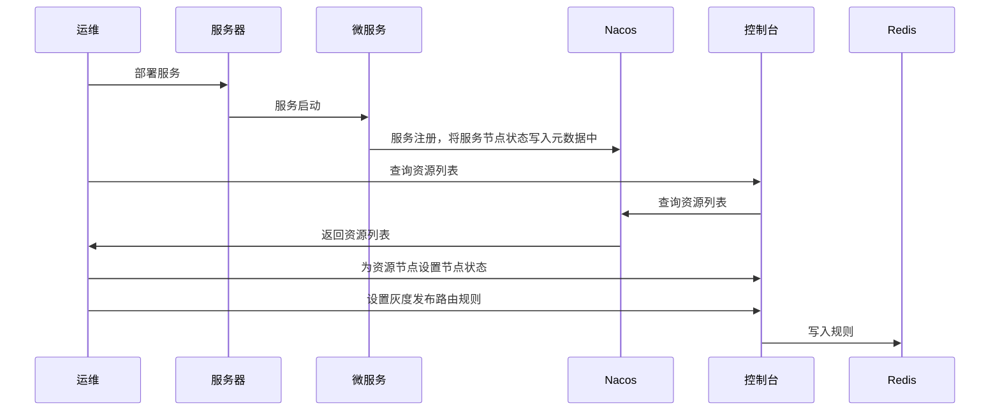
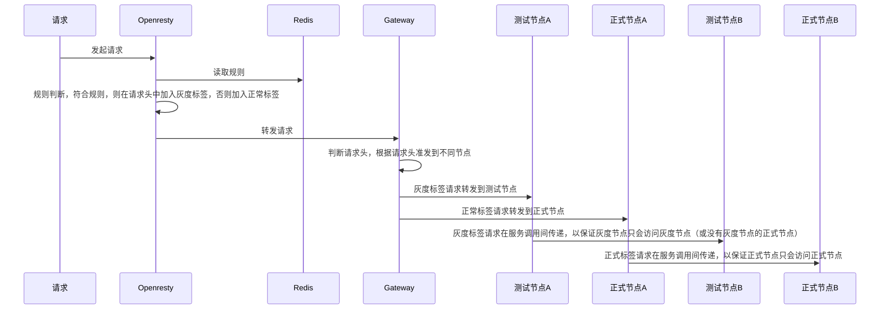

# grayscale-publishing

简单的灰度发布方案

## 使用条件

1. Nacos注册中心
2. Spring Cloud
2. Openresty网关（nginx的升级版本，可由nginx直接升级，也可用Spring Cloud Gateway，只是需要一些小改动）
3. 基于Ribbon的负载均衡
4. 服务间调用使用OpenFeign

## 名词解释

1. 资源节点：指一个微服务或一个微服务对应的前端静态资源
2. 资源节点类型：目前分为API(后台服务)、STATIC(静态资源)两类
3. 资源节点状态：0: 未就绪、1: 正式节点、2: 测试节点（灰度节点）
4. 灰度发布路由规则: 决定什么样的请求路由向测试节点的规则
5. 灰度发布路由规则类型: 目前仅支持IP白名单，计划支持用户（组织、部门...）、流量

## 整体逻辑

1.服务部署与开启灰度发布



2.流量路由



## 模块介绍

### [grayscale-publishing-api-resource-example](./grayscale-publishing-api-resource-example)

微服务示例模块，可按照该模块改造现有微服务，改造相对简单，只需引入本项目中的路由starter即可。

#### 使用spring-web:

```xml

<dependency>
   <groupId>com.xiao.yi</groupId>
   <artifactId>grayscale-publishing-route-web-spring-cloud-starter</artifactId>
   <version>${project.version}</version>
</dependency>
```

#### 使用spring-webflux，使用该模式的web服务，还需一些额外的改造，详见[grayscale-publishing-api-resource-example](#grayscale-publishing-route-webflux-spring-cloud-starter):

```xml

<dependency>
   <groupId>com.xiao.yi</groupId>
   <artifactId>grayscale-publishing-route-web-spring-cloud-starter</artifactId>
   <version>${project.version}</version>
</dependency>
```

### [grayscale-publishing-control](./grayscale-publishing-control)

灰度发布控制台模块，该模块提供节点分类、灰度发布路由规则、静态资源部署（预计实现）功能，是对于灰度发布流程的总控制模块，包含后台服务和简单前端页面。

### [grayscale-publishing-gateway](./grayscale-publishing-gateway)

基于Spring Cloud
Gateway的微服务网关，主要负责根据Http请求中的请求头路由到对应的服务节点，包含特殊的[自定义filter](./grayscale-publishing-gateway/src/main/java/com/xiao/yi/gateway/filter/GrayscalePublishingLoadBalancerClientFilter.java)(
对于Webflux方式的web服务的特殊路由处理，详见[grayscale-publishing-api-resource-example](#grayscale-publishing-route-webflux-spring-cloud-starter))。

### [grayscale-publishing-openresty-lua](./grayscale-publishing-openresty-lua)

外部请求的第一入口，灰度发布路由规则的执行者，根据灰度发布路由规则，对符合规则的请求标记灰度标签（添加GRAYSCALE_PUBLISHING请求头）。  
使用Openresty作为网关，使用lua脚本对该网关进行扩展。

### [grayscale-publishing-openresty-plugin](./grayscale-publishing-openresty-plugin)

Openresty扩展lua脚本开发时使用的插件，主要用于对conf、lua脚本文件的清理和复制（一般lua脚本开发使用Ant作为开发插件，我习惯用Maven，所以自己写了个简单的插件，可使用你喜欢的方式开发lua脚本，另外Ant脚本运行速度稍快）。

### [grayscale-publishing-route-web-spring-cloud-starter](./grayscale-publishing-route-web-spring-cloud-starter)

微服务间调用的负载均衡策略，基于

```xml

<dependency>
   <groupId>com.alibaba.cloud</groupId>
   <artifactId>spring-cloud-starter-alibaba-nacos-discovery</artifactId>
</dependency>
```

改造，封装了NacosServerList，以支持Ribbon的负载均衡策略，根据请求头中的灰度标签，决定路由的目标服务节点。

### [grayscale-publishing-route-webflux-spring-cloud-starter](./grayscale-publishing-route-webflux-spring-cloud-starter)

负载均衡策略同web模式，不同的是，在webflux模式下，无法在负载均衡阶段读取到Http请求，所以采用在负载均衡前改变请求目标服务节点名的形式实现对于灰度标签的解析。
在负载均衡前，在服务名后拼接灰度标签，在负载均衡时，根据服务名中是否包含灰度标签，来决定此次请求是否路由向灰度节点。所以对于webflux形式的web服务，无法直接引入依赖使用，需进行一些改造工作。


